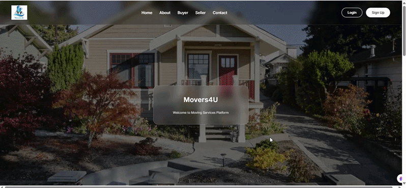

<div align="center">

# Movers4U

### Real Estate Marketplace

Movers4U is a full-stack real estate marketplace designed to connect property buyers and sellers through a role-based web application. The platform allows sellers to submit property listings, buyers to browse and purchase approved properties, and administrators to manage and approve property listings.


</div>

---

## About

**Movers4U** is a full-stack real estate marketplace designed to provide a platform where users can discover, list, manage, and purchase properties.

The application provides separate functionality for **Buyers, Sellers, and Administrators**. Sellers can submit property listings, administrators can review and manage listings, and buyers can browse approved properties and purchase available properties.

The project combines a **React frontend** with a **Node.js and Express backend**, using **MySQL with Sequelize** for data management.

---

## **Product Demo**

<p align="center">
  
</p>

---

## Features

### Authentication & Account Management

* User registration and login
* Role-based user accounts
* JWT-based authentication
* Password hashing with bcrypt
* OTP verification
* Forgot and reset password functionality

### Buyer Features

* Browse approved properties
* View property details and images
* View seller information
* Purchase available properties
* Track purchased property information

### Seller Features

* Create property listings
* Upload property images
* Manage listed properties
* Submit properties for admin approval
* Track property approval status

### Admin Features

* View property listings
* Review pending properties
* Approve or reject property listings
* Filter properties by status
* Manage property status

### Property Management

Properties include information such as title, description, category, size, rooms, price, location, images, seller details, approval status, views, and sale information.

---

## **Tech Stack**

| Category                       | Technologies                                       |
| ------------------------------ | -------------------------------------------------- |
| **Frontend**                   | React, React Router, Axios, Vite, JavaScript, CSS3 |
| **Backend**                    | Node.js, Express.js                                |
| **Database**                   | MySQL, Sequelize ORM                               |
| **Authentication & Security**  | JWT, bcryptjs, OTP Verification                    |
| **File & Email Services**      | Multer, Nodemailer, Twilio                         |
| **Configuration & Middleware** | CORS, dotenv                                       |

---

## Project Structure

```text
Movers4U/
│
├── backend/
│   ├── config/
│   │   └── database.js
│   │
│   ├── controllers/
│   │   ├── authController.js
│   │   ├── contactController.js
│   │   ├── houseController.js
│   │   └── otpController.js
│   │
│   ├── middlewares/
│   │   ├── authMiddleware.js
│   │   ├── uploadHouseImages.js
│   │   └── uploadMiddleware.js
│   │
│   ├── models/
│   │   ├── Contact.js
│   │   ├── House.js
│   │   └── User.js
│   │
│   ├── routes/
│   │   ├── authRoutes.js
│   │   ├── contactRoutes.js
│   │   ├── houseRoutes.js
│   │   └── otpRoutes.js
│   │
│   ├── services/
│   │   └── otpService.js
│   │
│   ├── package.json
│   └── server.js
│
├── frontend/
│   ├── src/
│   │   ├── assets/
│   │   ├── components/
│   │   ├── pages/
│   │   ├── api.js
│   │   ├── App.jsx
│   │   ├── main.jsx
│   │   └── styles.css
│   │
│   ├── package.json
│   ├── index.html
│   └── vite.config.js
│
├── .gitignore
└── README.md
```

---

## Application Workflow

```text
                         Movers4U
                            │
             ┌──────────────┼──────────────┐
             │              │              │
           Buyer          Seller          Admin
             │              │              │
             │         Create Listing      │
             │              │              │
             │              ▼              │
             │           Pending            │
             │              │              │
             │              └──────► Review
             │                         │
             │                    ┌────┴────┐
             │                    │         │
             │                Approved   Rejected
             │                    │
             ▼                    ▼
       Browse Properties    Available to Buyer
             │
             ▼
          Purchase
             │
             ▼
       Sold Property
```

---

## Database

Movers4U uses **MySQL** with **Sequelize ORM**.

### User

The User model stores account and authentication information, including user roles and verification-related information.

### House

Stores property details, location, price, images, seller information, approval status, views, and sale information.

### Contact

The Contact model stores information submitted through the contact form.

---

## Authentication

Movers4U uses JWT-based authentication to protect authenticated functionality.

Passwords are securely hashed using **bcryptjs**.

The application also includes OTP functionality for account verification and password recovery.

Sensitive configuration values are stored using environment variables.

---

## API

The backend provides API routes for authentication, OTP verification, property management, and contact submissions.

### Authentication

```text
POST /api/auth/signup
POST /api/auth/login
POST /api/auth/forgot-password
POST /api/auth/reset-password
```

### OTP

```text
POST /api/otp/verify
POST /api/otp/resend
```

### Properties

```text
GET  /api/houses
GET  /api/houses/approved
GET  /api/houses/:id
GET  /api/houses/pending
GET  /api/houses/seller-houses
GET  /api/houses/status/:status

POST /api/houses/create
POST /api/houses/buy/:id

PUT  /api/houses/:id/status
PUT  /api/houses/approve/:id
PUT  /api/houses/reject/:id
```

### Contact

```text
POST /api/contact/submit
```

---

## Installation & Setup

### 1. Clone the Repository

```bash
git clone https://github.com/YOUR-USERNAME/Movers4U.git
cd Movers4U
```

### 2. Install Frontend Dependencies

```bash
cd frontend
npm install
```

### 3. Install Backend Dependencies

Open a new terminal and run:

```bash
cd backend
npm install
```

---

## Running the Application

### Start the Backend

From the `backend` directory:

```bash
npm start
```

### Start the Frontend

From the `frontend` directory:

```bash
npm run dev
```

Vite will display the local development URL in the terminal.

---

## License

This project is developed as a software project and learning application.
